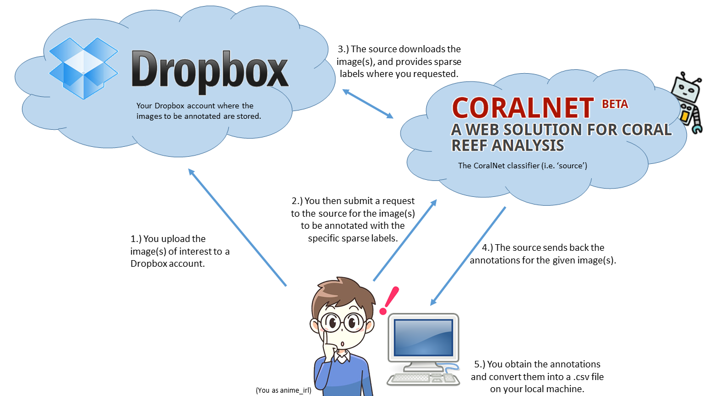

# CoralNet_API

This repository provides a Python library for accessing data on CoralNet through code, which allows users to programmatically interact with CoralNet and perform tasks such as uploading and downloading data, and annotating images.

For all of these scripts, it is recommended to set your CoralNet username and password as an environment variable, as
these will be read as the defaults when running the script via command line:
```python

# Windows
set CORALNET_USERNAME=myusername
set CORALNET_PASSWORD=mypassword

# Linux, macOS
export CORALNET_USERNAME=myusername
export CORALNET_PASSWORD=mypassword
```

### Download CoralNet

This script can be used to download all data (labelset, images, annotations) from any public source. The script is setup
to work via command line, and expects the following:
- `username` - CoralNet username; will also read the environmental variable `CORALNET_USERNAME`.
- `password` - CoralNet password; will also read the environmental variable `CORALNET_PASSWORD`.
- `source_ids` - A list of source IDs you want to download.
- `output_dir` - A directory that will contain all downloaded data.

Example of use:
`python Download_CoralNet.py --username JohnDoe --password 123456789 --source_ids 1 54 983 --output_dir downloads`

If you previously set the environmental variables `CORALNET_USERNAME` and `CORALNET_PASSWORD`, these will be read as
the defaults, and you can avoid passing the respective variables via command line.

Data will be downloaded in the following folder structure (for an example, see `../CoralNet_Data`):
```python
output_dir/
    source_id_1/
        images/
        annotations.csv
        label_set.csv
        images.csv
    source_id_2/
        images/
        annotations.csv
        label_set.csv
        images.csv
```
Although `Download_CoralNet.py` will just download the data for each public source desired, it also contains functions 
that would allow you to:
- Identify all labelsets
- Identify all public sources
- Download all public sources given a list of desired labelsets
- Download all data from all the public sources in CoralNet

Overall, the `Download_CoralNet.py` script is meant to offer researchers convenient ways to access and download CoralNet data for further analysis and processing. Please do not abuse CoralNet: its services are a useful resource to the coral research community.

### Upload CoralNet

This script can be used to automate the process of uploading images, annotations, and a labelset given a source ID.
The script is setup to work via command line, and expects the following:
- `username` - CoralNet username; will also read the environmental variable `CORALNET_USERNAME`.
- `password` - CoralNet password; will also read the environmental variable `CORALNET_PASSWORD`.
- `source_id` - The ID of the source you want to upload data to; your account must already have access to the source.
- `image_folder` - (optional) A folder containing images that you want to upload.
- `labels` - (optional) A .csv file containing point annotations.
- `labelset` - (optional) A .csv file containing the labelsets.

Example of use:
`python Upload_CoralNet.py --username JohnDoe --password 123456789 --source_id 1 --image_folder path/to/images/ --labels labels.csv --labelset labelset.csv`

If you previously set the environmental variables `CORALNET_USERNAME` and `CORALNET_PASSWORD`, these will be read as
the defaults, and you can avoid passing the respective variables via command line.

Things to note:
- If you attempt to upload a label file without setting any labelsets, CoralNet will throw an error; additionally, if you attempt to upload a label file with class categories that are not within the registered labelset, CoralNet will throw an error.
- If you attempt to upload images with names that already exist, CoralNet wil throw an error.


### CoralNet API

This script can be used to have an existing source's model perform predictions on publically available images.

To get started, users can refer to the `Tutorial.ipynb` included in this repository. This notebook provides a step-by-step guide for setting up a Dropbox account, obtaining authorization, and making requests to CoralNet using the CoralNet API.

Users can also refer to the API documentation provided by CoralNet for more information on the available API endpoints and their usage.




