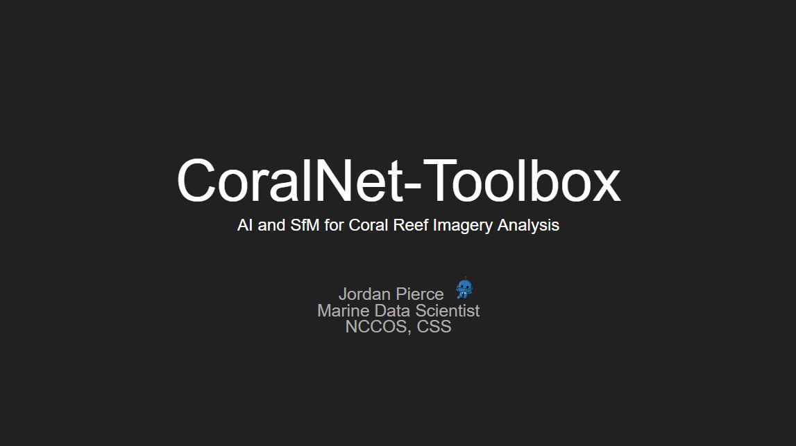

# Demo

This presentation showcases the steps to using the CoralNet-Toolbox. In this example, we use the 
[D3](https://csms.haifa.ac.il/profiles/tTreibitz/datasets/sea_thru/index.html) dataset. The Google Slides,
video explanation, classified output, and CoralNet source can be found at the links below.

    
   <a href="https://docs.google.com/presentation/d/19uxGpdyaR__8rqKWrSKKGH7HspIMf-v9G75Sc5Ki_vU/edit?usp=sharing">[Google Slides]</a> 
      <a href="https://ncsu.zoom.us/rec/play/N6nmQflBo-awsowszeBWDNIcBHA5mkl6vOeGIT94nbVkGkcTN9M9IXsCzKxB0qOl459DFZVbgWSGEGu8.lRCBOBdXjFhuLz1_?canPlayFromShare=true&from=share_recording_detail&startTime=1695067176000&componentName=rec-play&originRequestUrl=https%3A%2F%2Fncsu.zoom.us%2Frec%2Fshare%2Fca8YOdXyDfMBDOto9eHqaoOcMzKRdg4LjqKtt2BPSxzzg96zEjGfKeY1dlIkdBCb.vStQgHc6ndVGDEHx%3FstartTime%3D1695067176000">[Video]</a>
      <a href="https://www.youtube.com/watch?v=fNpNh8zgCuM">[Classified Output]</a>
      <a href="https://coralnet.ucsd.edu/source/4356/">[CoralNet Source]</a>

