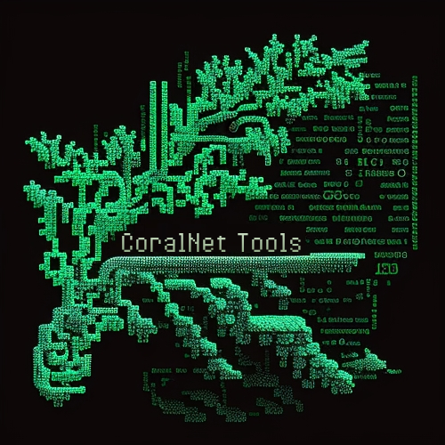

# CoralNet_Tools  

  

### About CoralNet
Coral reefs are vital ecosystems that support a wide range of marine life and provide numerous benefits to humans. However, they are under threat due to climate change, pollution, overfishing, and other factors. CoralNet is a platform designed to aid researchers and scientists in studying these important ecosystems and their inhabitants.

CoralNet allows users to upload photos of coral reefs and annotate them with detailed information about the coral species and other features present in the images. The platform also provides tools for analyzing the annotated images, such as image classification and semantic segmentation.

### Tools Available in this Repository
This repository contains a collection of tools that can be used to interact with CoralNet and perform various tasks related to analyzing the annotated images. The following is a list of the tools currently available:

#### CoralNet_3D
CoralNet_3D is a set of tools for representing single images as 3D point clouds. Images are provided depth maps using MiDAS and represented as a point cloud with RGB color component values coming from the original images. This tool can be useful for visualizing the annotated images in 3D and analyzing their structure.

#### CoralNet_API
CoralNet_API is a Python library for accessing the CoralNet API, which allows users to programmatically interact with CoralNet and perform tasks such as uploading and downloading data, annotating images, and managing user accounts. This library can be used to automate tasks and integrate CoralNet functionality into other applications.

#### CoralNet_Crawler
CoralNet_Crawler is a tool for automatically downloading large numbers of images and annotations from CoralNet, using a customizable set of search criteria. This tool can be used to gather large datasets of annotated images for analysis or machine learning purposes.

#### Image_Classifier
Image_Classifier is a set of tools for training your own patch-based image classifier using the images and annotations downloaded from CoralNet, or those that you create using the Patch_Extractor tool. This tool can be used to classify images based on the presence of specific features or coral species.

#### Patch_Extractor
Patch_Extractor is a tool for dividing annotated images into smaller patches, which can be useful for training machine learning models on the annotated data. This tool can be used to generate training datasets for image classification or semantic segmentation.

#### Semantic_Segmentation
Semantic_Segmentation is a set of tools for training a semantic segmentation algorithm using the images and annotations downloaded from CoralNet, or those you create using the Patch_Extractor tool. This tool can be used to segment images into different regions based on the presence of specific features or coral species.

#### How to use
To use these tools, you need to have access to the CoralNet platform. Once you have an account, you can use the CoralNet_API library to programmatically interact with the platform and perform various tasks.

You can use the CoralNet_Crawler tool to download images and annotations from CoralNet that match specific search criteria. These images can then be used to train machine learning models using the Image_Classifier and Semantic_Segmentation tools.

The Patch_Extractor tool can be used to extract smaller patches from annotated images. These patches can be used to train machine learning models that can classify different types of corals or perform semantic segmentation on coral reefs.

### Conclusion
In summary, this repository provides a range of tools that can assist with interacting with CoralNet and performing various tasks related to analyzing annotated images. These tools can be useful for researchers and scientists working with coral reefs, as well as for students and hobbyists interested in learning more about these important ecosystems.