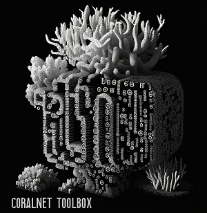
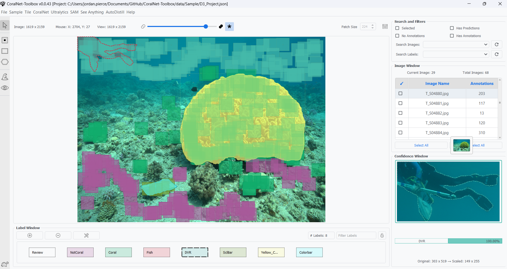

# CoralNet Toolbox  


<p align="center">
  
</p>

---

For information on how to use, check out the [docs](./docs)

### [**Tools**](Toolbox/README.md#coralnet-toolbox)

The `CoralNet Toolbox` is an **unofficial** codebase that can be used to augment processes associated
with those on CoralNet. The toolbox includes the following:

- `API`: Use the CoralNet API to get predictions from any source model
- `Download`: Download all data associated with a source
- `Upload`: Upload images, annotations, and labelsets to a source
- `Classification`: Create your own patch-based image classifier, locally
- `Classification Inf.`: Perform inference using a locally trained classification model
- `Annotate`: Create your own patches from annotations, locally
- `Visualize`: Visualize points/patches superimposed on images
- `Patches`: Extract patches from images given an annotation file
- `Points`: Sample points from images (Uniform, Random, Stratified)

<p align="center">
  
</p>

### **How to Install**

##### GitHub Repository
First, clone the repo:
```bash
# cmd

# Clone and enter the repository
git clone https://github.com/Jordan-Pierce/CoralNet-Toolbox.git
cd CoralNet-Toolbox/toolshed
```
##### Anaconda
Then set up an `Anaconda` environment:
```bash
# cmd

# Create and activate an environment
conda create --name coralnet-toolbox python=3.8 -y
conda activate coralnet-toolbox
```
##### CUDA
Once this has finished, if you have CUDA, you can install the versions of `cuda-nvcc` and `cudatoolkit` that you need,
and then install the corresponding versions `torch` and `torchvision`:
```bash
# cmd

# Example for CUDA 11.8
conda install cuda-nvcc -c nvidia/label/cuda-11.8.0 -y
conda install cudatoolkit=11.8 -c nvidia/label/cuda-11.8.0 -y

# Example for torch 2.0.0 and torchvision 0.15.1 w/ CUDA 11.8
pip install torch==2.0.0+cu118 torchvision==0.15.1+cu118 --extra-index-url https://download.pytorch.org/whl/cu118
```
See here for more details on [PyTorch](https://pytorch.org/get-started/locally/) versions.
##### Install
Finally, run the setup script to install the toolbox:
```bash
# cmd

pip install -e .

coralnet-toolbox
```


### [**About CoralNet**](https://coralnet.ucsd.edu/source/)
Coral reefs are vital ecosystems that support a wide range of marine life and provide numerous 
benefits to humans. However, they are under threat due to climate change, pollution, overfishing, 
and other factors. CoralNet is a platform designed to aid researchers and scientists in studying 
these important ecosystems and their inhabitants.

CoralNet allows users to upload photos of coral reefs and annotate them with detailed information 
about the coral species and other features present in the images. The platform also provides tools 
for analyzing the annotated images, and create patch-based image classifiers. 

The CoralNet Toolbox is an unofficial tool developed to augment processes associated with analyses that 
use CoralNet and Coral Point Count (CPCe).


### **Conclusion**
In summary, this repository provides a range of tools that can assist with interacting with 
CoralNet and performing various tasks related to analyzing annotated images. These tools can be 
useful for researchers and scientists working with coral reefs, as well as for students and
hobbyists interested in learning more about these important ecosystems.


### Citation

If used in project or publication, please attribute your use of this repository with the following:
    
```
@misc{CoralNet-Toolbox,
  author = {Pierce, Jordan and Edwards, Clint and Vieham, Shay and Rojano, Sarah and Cook, Sophie and Costa, Bryan and Sweeney, Edward and Battista, Tim},
  title = {CoralNet-Toolbox},
  year = {2023},
  howpublished = {\url{https://github.com/Jordan-Pierce/CoralNet-Toolbox}},
  note = {GitHub repository}
}
```

### References  

The following papers inspired this repository:
```python
Pierce, J., Butler, M. J., Rzhanov, Y., Lowell, K., &amp; Dijkstra, J. A. (2021).
Classifying 3-D models of coral reefs using structure-from-motion and multi-view semantic segmentation.
Frontiers in Marine Science, 8. https://doi.org/10.3389/fmars.2021.706674

Pierce, J. P., Rzhanov, Y., Lowell, K., &amp; Dijkstra, J. A. (2020).
Reducing annotation times: Semantic Segmentation of coral reef survey images.
Global Oceans 2020: Singapore – U.S. Gulf Coast. https://doi.org/10.1109/ieeeconf38699.2020.9389163

Beijbom, O., Edmunds, P. J., Roelfsema, C., Smith, J., Kline, D. I., Neal, B. P., Dunlap, M. J., Moriarty, V., Fan, T.-Y., Tan, C.-J., Chan, S., Treibitz, T., Gamst, A., Mitchell, B. G., &amp; Kriegman, D. (2015).
Towards automated annotation of benthic survey images: Variability of human experts and operational modes of automation.
PLOS ONE, 10(7). https://doi.org/10.1371/journal.pone.0130312
```
---

### Disclaimer

This repository is a scientific product and is not official communication of the National 
Oceanic and Atmospheric Administration, or the United States Department of Commerce. All NOAA 
GitHub project code is provided on an 'as is' basis and the user assumes responsibility for its 
use. Any claims against the Department of Commerce or Department of Commerce bureaus stemming from 
the use of this GitHub project will be governed by all applicable Federal law. Any reference to 
specific commercial products, processes, or services by service mark, trademark, manufacturer, or 
otherwise, does not constitute or imply their endorsement, recommendation or favoring by the 
Department of Commerce. The Department of Commerce seal and logo, or the seal and logo of a DOC 
bureau, shall not be used in any manner to imply endorsement of any commercial product or activity 
by DOC or the United States Government.


### License 

Software code created by U.S. Government employees is not subject to copyright in the United States 
(17 U.S.C. §105). The United States/Department of Commerce reserve all rights to seek and obtain 
copyright protection in countries other than the United States for Software authored in its 
entirety by the Department of Commerce. To this end, the Department of Commerce hereby grants to 
Recipient a royalty-free, nonexclusive license to use, copy, and create derivative works of the 
Software outside of the United States.