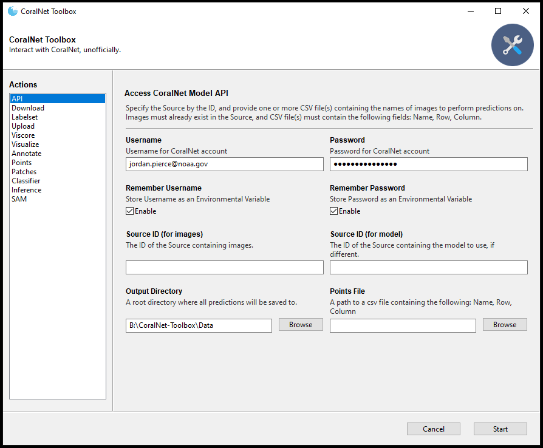

# CoralNet Toolbox  


<p align="center">
  
</p

---

### **About CoralNet**
Coral reefs are vital ecosystems that support a wide range of marine life and provide numerous 
benefits to humans. However, they are under threat due to climate change, pollution, overfishing, 
and other factors. CoralNet is a platform designed to aid researchers and scientists in studying 
these important ecosystems and their inhabitants.

CoralNet allows users to upload photos of coral reefs and annotate them with detailed information 
about the coral species and other features present in the images. The platform also provides tools 
for analyzing the annotated images, and create patch-based image classifiers. 

### **Tools**

The `CoralNet-Toolbox` is an unofficial codebase that can be used to augment processes associated
with those on CoralNet, including:
- `API`: Easily use the CoralNet API to get predictions from any source model
- `Download`: Download all data associated with a source
- `Upload`: Upload images, annotations, and labelsets to a source
- `Labelset`: Create a custom labelset
- `Viscore`: Upload annotations made in Viscore's VPI to CoralNet
- `Classifier`: Create your own patch-based image classifier, locally
- `Annotate`: Create your own patches, locally
- `Visualize`: Visualize points, patches superimposed on images
- `Patches`: Extract patches from images given an annotation file
- `Points`: Sample points from images (Uniform, Random, Stratified)
- `Inference`: Perform inference using a locally trained model


<p align="center">
  
</p

#### **Future Features**
- `Analysis`: Calculate CPCe statistics from locally trained model's predictions
- `Clean`: Use `CleanLab.ai` to identify potentially incorrectly labeled patches
- `Segment`: Create segmentation masks for each image using `MSS`, `SAM`
- `GAN`: Synthesize samples using generative AI

#### **How to use**
To use these tools, you should have access to the CoralNet platform. Once you have an account, 
you can use the `CoralNet-Toolbox` codebase to programmatically interact with the platform and perform 
various tasks.

To install, use the `coralnet_toolbox.yml` file using anaconda:
```python
# cmd
conda env create -f coralnet_toolbox.yml
conda activate coralnet_toolbox
python Toolbox\toolbox.py
```

### **Conclusion**
In summary, this repository provides a range of tools that can assist with interacting with 
CoralNet and performing various tasks related to analyzing annotated images. These tools can be 
useful for researchers and scientists working with coral reefs, as well as for students and
hobbyists interested in learning more about these important ecosystems.

### Citation

If used in project or publication, please attribute your use of this repository with the following:
    
```
@misc{CoralNet-Toolbox,
  author = {Pierce, Jordan and Edwards, Clint and Vieham, Shay and Rojano, Sarah and Cook, Sophie and Battista, Tim},
  title = {CoralNet Tools},
  year = {2022},
  howpublished = {\url{https://github.com/Jordan-Pierce/CoralNet_Tools}},
  note = {GitHub repository}
}
```

---

### Disclaimer

This repository is a scientific product and is not official communication of the National 
Oceanic and Atmospheric Administration, or the United States Department of Commerce. All NOAA 
GitHub project code is provided on an 'as is' basis and the user assumes responsibility for its 
use. Any claims against the Department of Commerce or Department of Commerce bureaus stemming from 
the use of this GitHub project will be governed by all applicable Federal law. Any reference to 
specific commercial products, processes, or services by service mark, trademark, manufacturer, or 
otherwise, does not constitute or imply their endorsement, recommendation or favoring by the 
Department of Commerce. The Department of Commerce seal and logo, or the seal and logo of a DOC 
bureau, shall not be used in any manner to imply endorsement of any commercial product or activity 
by DOC or the United States Government.


### License 

Software code created by U.S. Government employees is not subject to copyright in the United States 
(17 U.S.C. §105). The United States/Department of Commerce reserve all rights to seek and obtain 
copyright protection in countries other than the United States for Software authored in its 
entirety by the Department of Commerce. To this end, the Department of Commerce hereby grants to 
Recipient a royalty-free, nonexclusive license to use, copy, and create derivative works of the 
Software outside of the United States.
