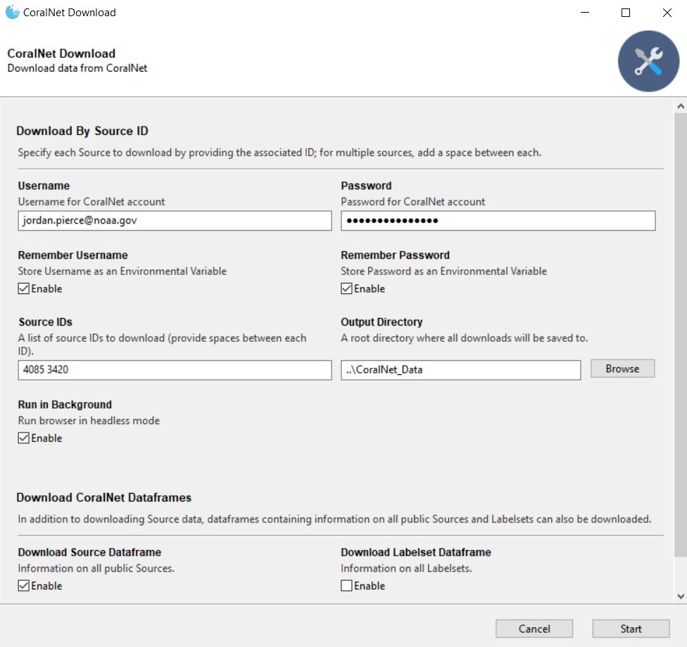
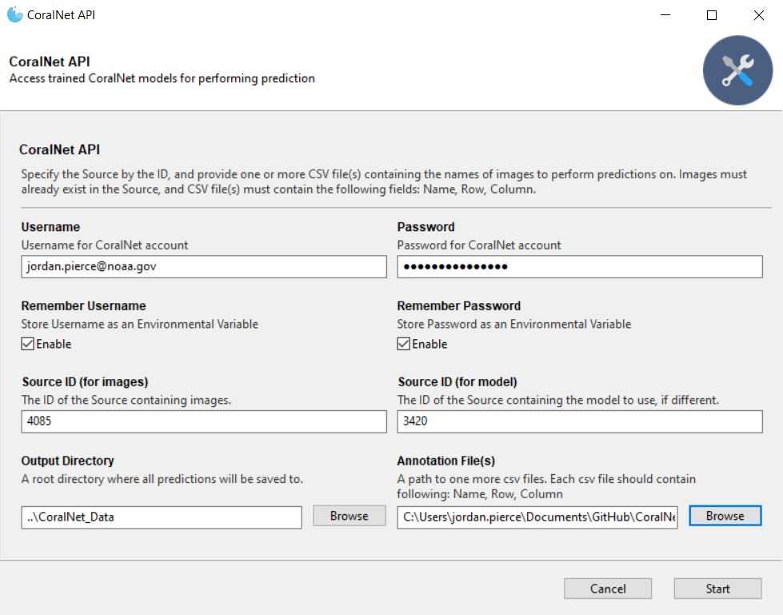
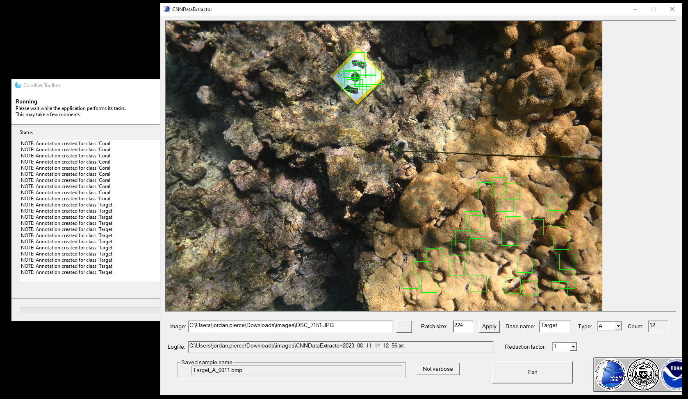
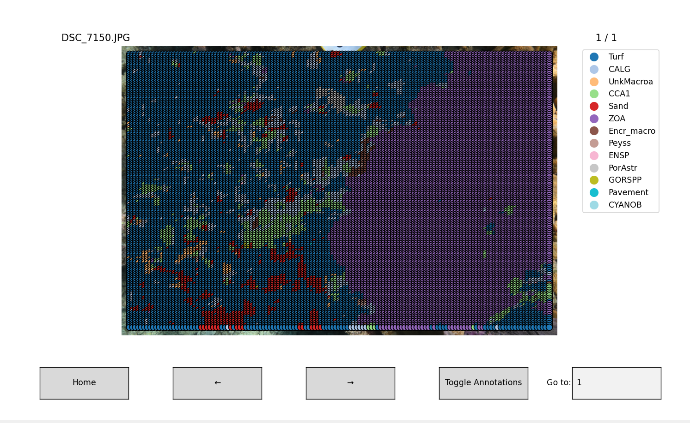

# CoralNet-Toolbox

**This `README` page is still under development, sorry.**

This codebase provides a Python library for accessing data on CoralNet 
through code, which allows users to programmatically interact with CoralNet and 
perform tasks such as uploading and downloading data, and annotating images.


## Getting Started

For most of these scripts, it is recommended to set your CoralNet `Username` and 
`Password` as an environment variables, as these will be read as the defaults when 
running all the script via command line:
```python
# Windows
setx CORALNET_USERNAME myusername
setx CORALNET_PASSWORD mypassword

# Linux, macOS
export CORALNET_USERNAME=myusername
export CORALNET_PASSWORD=mypassword
```

In root directory is a `requirements.txt` file that can be used to install all dependencies needed 
for these scripts (install using conda)

`$ conda create --name coralnet_api --file requirements.txt`

## Tools

Below is a description of each tool available for use.

## Download ⬇️  

This code can be used to download all data (model metadata, labelset, images, annotations) 
from any public source, or a private source if your account has access to. The 
script is set up to work via command line, and expects the following:
- `username` - CoralNet username; will also read the environmental 
  variable `CORALNET_USERNAME`
- `password` - CoralNet password; will also read the environmental variable 
  `CORALNET_PASSWORD`
- `source_ids` - A list of source IDs you want to download
- `output_dir` - A directory that will contain all downloaded data (`..CoralNet_Data/`)
- `headless` - Whether to run the browser in the background or not

Example of use:
```python 
python Download.py --username JohnDoe \
                   --password 123456789 \ 
                   --source_ids 4085 3420 \
                   --output_dir ../CoralNet_Data/
                   --headless True
```

If you previously set the environmental variables `CORALNET_USERNAME` and 
`CORALNET_PASSWORD`, these will be read as the defaults, and you can avoid 
passing the respective variables via command line.

Data will be downloaded in the following folder structure (for an example, 
see `../CoralNet_Data`):
```python
output_dir/

    source_id_1/
        images/
        annotations.csv
        labelset.csv
        images.csv
        metadata.csv
        
    source_id_2/
        images/
        annotations.csv
        labelset.csv
        images.csv
        metadata.csv
```
Although `Download.py` will just download the data for each public 
source desired, it also contains functions that would allow you to:
- Identify all labelsets on CoralNet (`download_coralnet_labelsets`)
- Identify all public sources CoralNet (`download_coralnet_sources`)
- Download all public sources given a list of desired labelsets (`get_sources_with`)
- Download all data from all the public sources in CoralNet

Overall, the `Download.py` script is meant to offer researchers 
convenient ways to access and download CoralNet data for further analysis and 
processing. **Please do not abuse CoralNet**: its services are an invaluable 
and useful resource to the coral research community.

**Things to note:**
- Downloading annotations takes the most time


<p align="center">
  
</p>


## Upload ⬆️  

This code can be used to automate the process of uploading images, 
annotations, and a labelset given a source ID. The script is set up to work via 
command line, and expects the following:
- `username` - CoralNet username; default env variable `CORALNET_USERNAME`
- `password` - CoralNet password; default env variable `CORALNET_PASSWORD`
- `source_id` - The ID of the source you want to upload data to; need access
- `image_folder` - (optional) A folder with images that you want to upload
- `annotations` - (optional) A .csv file with point annotations
- `labelset` - (optional) A .csv file with the labelsets
- `headless` - (optional) Whether to run browser in the background or not

The following describes what is expected of the annotations, and labelset:

```python
# annotations.csv

                                              Name   Row  Column  Label
-----------------------------------------------------------------------
0  mcr_lter1_fringingreef_pole1-2_qu1_20080415.jpg   671     217   Sand
1  mcr_lter1_fringingreef_pole1-2_qu1_20080415.jpg  1252     971   Sand
2  mcr_lter1_fringingreef_pole1-2_qu1_20080415.jpg   548    1054  Macro
```

```python
# labelset.csv

   Label ID     Short Code 
--------------------------
0        59         Acrop        
1        60         Astreo        
2        61         Cypha        
```

Example of usage:
```python 
python Upload.py --username JohnDoe \
                 --password 123456789 \ 
                 --source_id 1 \
                 --image_folder path/to/images/ \ 
                 --annotations annotations.csv \
                 --labelset labelset.csv
                 --headless True
```

If you previously set the environmental variables `CORALNET_USERNAME` and 
`CORALNET_PASSWORD`, these will be read as the defaults, and you can avoid 
passing the respective variables via command line.

**Things to note:**
- If you attempt to do the following, CoralNet will throw an error:
  - upload an annotation file without setting a labelset for the source
  - upload an annotation file with labels that are not within the 
    source labelset
  - upload an annotation file with images that are not within the source
- The order of uploading should be:
  - labelset and / or images
  - annotations


## API ☁️  

CoralNet's API can be very useful for getting model predictions from any public source, though 
the ability to do so is not universally accessible. This code can be used to have an existing source's 
model perform predictions on publicly available images. 

CoralNet's API expects URLs that are publicly available;it will the image and make predictions 
for it, given a list of points. In the original [tutorial](https://coralnet.ucsd.edu/pages/help/api/tutorials/) 
it was suggested that users upload images to a online storage drive, made public, and 
pass the URLs of the images to the API. Instead of doing that, this code uses functions 
in the CoralNet Download script to get a previously uploaded image's AWS URL and pass 
that the API. Therefore, any image you want to make predictions for must already be 
uploaded to a source on CoralNet (w/ or w/o annotations, doesn't matter). 
Once completed, predictions from the model will be saved in a `predictions` folder located
in the source folder within the output directory.

Alternatively, you could use the functions in the script to pass your own URLs, whether they 
reside on your Google Drive, DropBox, etc. Users can also refer to the API documentation provided by CoralNet for more 
information on the available API endpoints and their usage.

The script is setup to work via command line, and expects the following:
- `username` - CoralNet username; default env variable `CORALNET_USERNAME`
- `password` - CoralNet password; default env variable `CORALNET_PASSWORD`
- `source_id_1` - The ID of the source that contains the images you want predictions for
- `source_id_2` - The ID of the source with the model you want to use, if different
- `output_dir` - The directory where you want the predictions to be saved
- `csv_path` - Path to a CSV file (or folder containing multiple CSV files) 
  with columns `Name`, `Row` and `Column`

The following describes what is expected in the csv files:
```python
                                              Name   Row  Column  
----------------------------------------------------------------
0  mcr_lter1_fringingreef_pole1-2_qu1_20080415.jpg   671     217   
1  mcr_lter1_fringingreef_pole1-2_qu1_20080415.jpg  1252     971   
2  mcr_lter1_fringingreef_pole1-2_qu1_20080415.jpg   548    1054  
```  

Example of usage:
```python 
python API.py --username JohnDoe \
              --password 123456789 \ 
              --source_id_1 4085 \
              --source_id_2 3420 \
              --csv_path path/to/annotations.csv \ 
              --headless True
```

**Things to note:**
- Images you want predictions for must be uploaded to a source before using this script; it 
  doesn't matter which source, so long as you have access to it. You can then use that source's 
  model to make predictions, or any other source's model you have access to
- AWS URLs for images expire after 1 hour of creation; there is a process setup to check if an 
  image has expired, in which case the updated URL will be retrieved automatically
- The time it takes for the program to finish depends on the amount of images and points you 
  want predicted
- The latest (and most accurate) source's model will be used
- CoralNet allows each user have up to 5 active requests at any given time; each request can 
  contain up to 100 images, each having up 200 points to be annotated. Once a job has been 
  completed, the code will automatically send the next batch of images to the model; if images 
  expired during the waiting period, they will be added to a queue, and updated once there are 
  no more active jobs 
- Essentially, the API script will run indefinitely until all images have been passed to the 
  model; once it completes, the program will close

<p align="center">
  
</p>

## Annotate

<p align="center">
  
</p>


## Classifier
[will fill out eventually]


## Labelset
[will fill out eventually]


## Patches
<p align="center">

  
</p>

## Points
[will fill out eventually]


## SfM
[will fill out eventually]


## Viscore
[will fill out eventually]

## Inference 🦾  

<p align="center">
  
</p>

## SAM 🤖  

<p align="center">
  
</p>

## 3DSeg

<p align="center">
  <a href="https://youtu.be/ujum1wMqk30">
    
  </a>
</p>


## Notebooks 📓  

Before jumping into the scripts, it might be useful to play around with 
functions for some of the scripts via notebook. The notebooks contain examples and 
comments that may be useful for understanding and altering the code as 
needed. The notebooks are as follows:
- `API.ipynb` - Notebook for making predictions via CoralNet's API.
- `Classifier.ipynb` - Notebook for training a model, locally.
- `Download.ipynb` - Notebook for downloading data from CoralNet.
- `Labelset.ipynb` - Notebook for creating labelsets on CoralNet.
- `Patches.ipynb` - Notebook for creating patches, locally.
- `Upload.ipynb` - Notebook for uploading data to CoralNet.


## TODO
- Update this page to list all available tools
- Create `.exe` for `toolbox.py`

**Suggestions are welcome!**