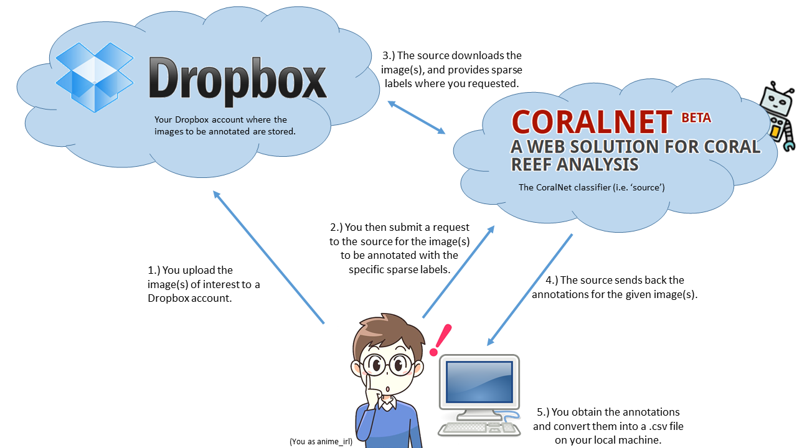

This repo's code is originally based on Scott Miller's and is meant to serve as a walk-through for using the CoralNet API.

CoralNet has recently opened up their API to the public allowing researchers to use their own, or any other publically available model to provide additional sparse labels to any image of interest. More helpful is the fact that users can request that the model label specific pixels in the image as opposed to just randomly placing points.

From start to finish, the `Requests.ipynb` notebook in this repo will help users setup a Dropbox account, obtain authorization and make requests to CoralNet.

