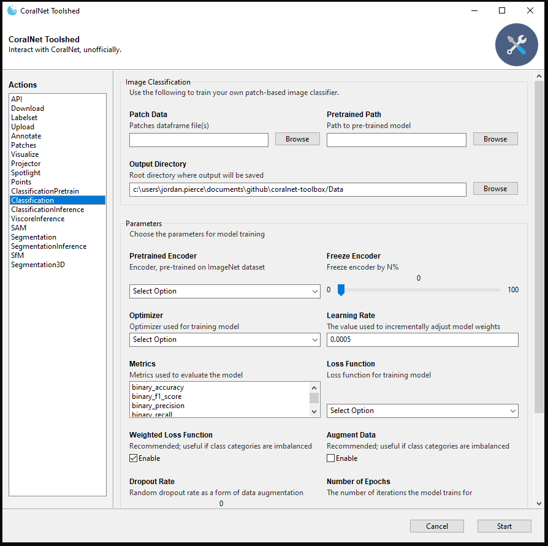

# CoralNet Toolshed  

---

### [**Tools**](src/README.md#coralnet-toolbox)

**The `CoralNet-Toolshed` is and older version of the `CoralNet-Toolbox`.**

The `CoralNet-Toolbox` is an **unofficial** codebase that can be used to augment processes associated
with those on CoralNet. The following scripts allow a user to run processes programmatically, or through 
a GUI; these scripts currently include the following:

- `API`: Use the CoralNet API to get predictions from any source model
- `Download`: Download all data associated with a source
- `Upload`: Upload images, annotations, and labelsets to a source
- `Labelset`: Create a custom labelset on CoralNet
- `Classification Pretrain`: Pretrain an encoder on unlabeled data before training with labeled data
- `Classification`: Create your own patch-based image classifier, locally
- `Classification Inf.`: Perform inference using a locally trained classification model
- `Viscore Inf.`: Perform inference using a locally trained model on Viscore VPI points
- `Annotate`: Create your own patches from annotations, locally
- `Visualize`: Visualize points/patches superimposed on images
- `Patches`: Extract patches from images given an annotation file
- `Points`: Sample points from images (Uniform, Random, Stratified)
- `Projector`: Display model predictions in feature space using Tensorboard
- `Spotlight`: Display model predictions in feature space using [Spotlight](https://www.youtube.com/watch?v=zj2JgBi7VeM)
- `SAM`: Create segmentation masks for each image using labeled points and SAM
- `Segmentation`: Create your own semantic segmentation model, locally
- `Segmentation Inf.`: Perform inference using a locally trained segmentation model
- `SfM`: Use Metashape to create 3D models (sure, why not)
- `Segmentation3D`: Use masks and SfM to create classified 3D models

<p align="center">
  
</p>

#### **How to Install**

First, clone the repo and set up an `Anaconda` environment:
```bash
# cmd

# Clone and enter the repository
git clone https://github.com/Jordan-Pierce/CoralNet-Toolbox.git
cd CoralNet-Toolbox/toolshed

# Create and activate an environment
conda create --name coralnet-toolshed python=3.8 -y
conda activate coralnet-toolshed
```
Once this has finished, you will need to install `CUDA 11.8` and `Torch 2.0.0`:
```bash
# cmd

# Install CUDA 11.8 and Torch 2.0.0
conda install cuda-nvcc -c nvidia/label/cuda-11.8.0 -y
conda install cudatoolkit=11.8 -c nvidia/label/cuda-11.8.0 -y
pip install torch==2.0.0+cu118 torchvision==0.15.1+cu118 --extra-index-url https://download.pytorch.org/whl/cu118

# Run the setup script
pip install -e .
```
Finally, to run the `CoralNet-Toolshed`, enter the following command:
```bash
# cmd

coralnet-toolshed
````

Note that the `CoralNet-Toolshed` has ***only*** been tested on the following:
- `Windows 10`
- `Python 3.8`
- `Torch 2.0.0 + CUDA 11.8`
- `Metashape Professional 2.0.2`